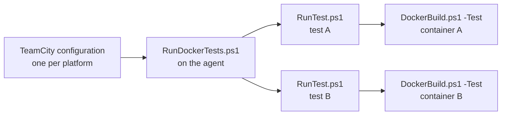

# Docker-Based Tests

A Docker-based test is a test that needs a container of its own. Each test builds its own image, runs one
container, and is judged by the exit code of that container.

Use this form only when the behaviour under test depends on the environment itself: a specific .NET SDK
version, a specific operating system or distribution, a specific processor architecture, or the fact of
running inside a container. An ordinary unit or integration test belongs in `dotnet test`.

> [!NOTE]
> `RunDockerTests.ps1` is **generated**. The source of truth is
> `src/PostSharp.Engineering.BuildTools/Resources/RunDockerTests.ps1`; regenerate the repository copy with
> `./Build.ps1 generate-scripts`. Never edit the generated file by hand.

## The container is what the test starts, not what it runs in

A product build runs inside the build container, because the tool chain it needs is there:
[DockerBuild.ps1](dockerbuild.md) resolves the product image chain, mounts the source tree and the caches,
and executes `Build.ps1` inside it.

A Docker test is the other way round. The tool chain under test is inside the test's own image, so the host
needs no product tool chain at all. Running these tests inside the build container would therefore mean
nesting one engine inside another to gain nothing: the tests would lose the agent's image cache and acquire
the build container's credentials.

So the launcher runs on the agent, and starts containers as siblings of nothing:



The host contract is PowerShell 7.5 and a container engine whose operating system and architecture match the
platform. No .NET SDK, no MSBuild, no Visual Studio. What the build produced reaches the agent through a
TeamCity artifact dependency, and each test addresses it by a path relative to the repository root, which
`DockerBuild.ps1` mounts into the container.

## Layout

One directory per test, flat, under a directory the launcher is pointed at:

```
Tests/Docker/
  Issue15-AssetsFileV4/
    test.psd1
    Dockerfile
    RunTest.ps1
    TestProject/...
```

The platforms a test runs on are declared in its manifest, not encoded in its position in the tree, because
most tests apply to more than one. The same Linux test should normally run on both `linux-x64` and
`linux-arm64`, and a directory per platform would mean duplicating the test to get that coverage.

### More than one operating system in one test

The launcher has no opinion about the Dockerfile: it runs `RunTest.ps1`, and `RunTest.ps1` decides which
Dockerfile to pass to `DockerBuild.ps1`. `Dockerfile` is therefore only a convention, and it holds for the
common case of a test whose platforms share one base image -- the two Linux architectures being the usual
example, since the same image manifest serves both.

A test whose manifest spans operating systems needs one Dockerfile per operating system, because the base
images have nothing in common. Name them `Dockerfile.linux` and `Dockerfile.windows` and select in
`RunTest.ps1`, which already receives the platform:

```
Tests/Docker/
  Issue22-CrossPlatform/
    test.psd1              # Platforms = @( 'linux-x64', 'linux-arm64', 'win-x64' )
    Dockerfile.linux
    Dockerfile.windows
    RunTest.ps1
```

```powershell
$os = if ($Platform -like 'linux-*') { 'linux' } else { 'windows' }

Invoke-PostSharpTestContainer `
    -Platform $Platform `
    -Dockerfile (Join-Path $PSScriptRoot "Dockerfile.$os") `
    -Command '...'
```

Prefer this to splitting the test in two when the scenario is genuinely the same one, so that it cannot be
fixed on one operating system and left broken on the other. Split it when the reproduction differs -- a
different command, a different fixture, a different assertion -- because two tests sharing a name and nothing
else are harder to read than two tests with two names.

### `test.psd1`

```powershell
@{
    # Required. The platforms this test runs on.
    Platforms = @( 'linux-x64', 'linux-arm64' )

    # Optional. Default 900. The container is killed and the test fails when it is exceeded.
    TimeoutSeconds = 900

    # Optional. When present, the test is reported as ignored on every platform, with this reason.
    Skip = 'Blocked by #1234.'
}
```

The platform identifiers are `win-x64`, `win-arm64`, `linux-x64` and `linux-arm64`. They name the container
engine's operating system and architecture, which is also what selects the agent.

A test whose manifest does not list the current platform is reported as ignored rather than omitted, so every
configuration's log shows the full inventory and says why each test did not run.

### `RunTest.ps1`

```powershell
param(
    [Parameter( Mandatory = $true )] [string] $Platform
)
```

The platform is all a test is told, because it is the only thing that varies per run. Everything else the test
addresses by a path relative to the repository root, because `DockerBuild.ps1` mounts the repository into the
container at its own path and the launcher runs the command with that as its working directory.

```powershell
. (Join-Path $PSScriptRoot '../Common.ps1')

Invoke-PostSharpTestContainer `
    -Platform $Platform `
    -Dockerfile (Join-Path $PSScriptRoot 'Dockerfile') `
    -Command ( 'cd Tests/Docker/TestProject && dotnet msbuild -t:Restore -t:Build ' +
               '/p:BaseIntermediateOutputPath=../.artifacts/Issue15/obj/ ' +
               '/p:BaseOutputPath=../.artifacts/Issue15/bin/' )

exit $LASTEXITCODE
```

### Outcomes

| Exit code | Outcome | Meaning |
|---|---|---|
| `0` | passed | |
| `4` | skipped | The test looked, and its scenario cannot occur on this host. |
| anything else | failed | |

Reserve exceptions for the harness failing, not for the code under test failing.

The skip code is not the same as the manifest's `Skip`. `Skip` states something known before the test runs --
a test disabled while an issue is open -- and applies on every platform. Exit code `4` is for what only the
test can discover once it has looked: an SDK that ships a pack the scenario needs absent, a case-insensitive
file system, a kernel without the facility under test. A test in that position has verified nothing, so
reporting it green would claim coverage that does not exist, and reporting it red would train people to ignore
a failing suite.

A skipping test should say why, on a line beginning with `SKIPPED:`. The launcher takes the last such line as
the reason and puts it in the TeamCity `testIgnored` message; without one the skip still counts, with a
generic reason.

```powershell
if (Test-Path '/usr/share/dotnet/packs/NETStandard.Library.Ref')
{
    Write-Host 'SKIPPED: this SDK installs the pack, so the probe answers and the scenario cannot occur.'
    exit 4
}
```

In TeamCity the test is then reported as ignored rather than failed:

```
##teamcity[testStarted name='Issue109-MissingTargetingPack']
##teamcity[testIgnored message='this SDK installs the pack, ...' name='Issue109-MissingTargetingPack']
##teamcity[testFinished duration='762' name='Issue109-MissingTargetingPack']
```

### Nothing is copied into the image

The Dockerfile is the base image and nothing else:

```dockerfile
FROM mcr.microsoft.com/dotnet/sdk:10.0-alpine
```

The sources are not staged into a build context, because the repository is already there. A test therefore
builds the real project at its real path, `Directory.Build.props` resolves as it does on the host, and relative
paths inside a project mean what they say. The build context stays whatever directory holds the Dockerfile,
which is small and stable, so the content hash that `DockerBuild.ps1` folds into the image tag is stable too.

This is the same model every other build in `DockerBuild.ps1` uses. Test mode changes what is *run* in the
container, not what the container can see: the repository, the caches and the dependency repositories from
`DockerMounts.g.ps1` are all mounted, because a test that consumes a source dependency needs the same
repositories the build needs.

The NuGet cache is one of those mounts, and the container deletes this product's packages from it before the test
command runs — `rm -rf … && <command>`, in the shell the test command already goes through, because a test image
need not carry PowerShell and so cannot run `eng/CleanUpBuildAgent.ps1` itself. `DockerBuild.ps1` asks that script
for the command (`-EmitTestCommandPrefix`), so the packages and the way they are deleted stay in one place. Without
it a test restores whatever an earlier build left in the cache rather than the artifacts under test, since every CI
build carries the same package version. A removal that fails means the test command never runs. See
[dockerbuild.md](dockerbuild.md#clearing-the-stale-product-packages-from-the-nuget-cache).

### Two consequences to respect

**The repository's MSBuild configuration applies.** A project built inside the mount inherits every
`Directory.Build.props` and `global.json` above it. That is usually what you want — it is how `PostSharpBinDir`
resolves — but a `global.json` pinning an SDK the image does not carry will fail the test. Shadow it with a
`global.json` in the test suite directory that rolls forward:

```json
{ "sdk": { "version": "8.0.100", "rollForward": "latestMajor", "allowPrerelease": true } }
```

**Output must go outside the project directory.** Several tests share one project, and the SDK globs `**/*.cs`
under a project while excluding only the intermediate directory of the build in progress. A sibling test's
generated `AssemblyInfo.cs` left under the project is therefore compiled into this test's build, which fails
with `CS0579: Duplicate ... attribute`. Give each test its own `BaseIntermediateOutputPath` and `BaseOutputPath`
under a gitignored directory beside the project, never inside it.

The script must not write TeamCity service messages. The launcher owns that protocol, and a test that writes
its own produces nested, malformed reporting. It is also what keeps a test runnable by hand:

```powershell
pwsh ./Tests/Docker/Issue15-AssetsFileV4/RunTest.ps1 -Platform linux-x64
```

## `DockerBuild.ps1 -Test`

A test builds and runs its container through `DockerBuild.ps1 -Test` rather than calling `docker` directly,
for the image and registry logic that script already carries and that a container-per-test suite depends on
more than any other consumer:

- A content-hash tag per image, so that identical inputs produce identical tags and hit the cache.
- Line-ending normalization before hashing, so a checkout with LF and one with CRLF share a tag.
- Push to and pull from the configured registry, so an image built once on one agent is not rebuilt on the
  next.
- Removal of unused images, oldest first, when the image store exceeds `-MaxImageSpace`.

`-Test` requires `-Dockerfile` and `-Command`, and takes an optional `-Context` that defaults to the
directory containing the Dockerfile, and an optional `-OS` covered in the next section.

Callers splat a **hashtable**, never an array. `& ./DockerBuild.ps1 @arguments` with an array does not bind
these parameters: `-BuildArgs` takes the remaining arguments, every value lands there, and the script goes on
to run an ordinary product build -- forwarding the product secrets -- instead of the test container. That
failure is silent and its consequences are not, so the script refuses an argument that names one of its own
parameters but was not bound to it.

Compared with a normal run, `-Test` does not resolve the product image chain and does not generate or run
`Init.g.ps1`. What it does **not** change is the mounts: the repository, the caches, the source dependencies
and the sibling repositories are all mounted as they are for any build, and the command runs with the
repository as its working directory. A test consuming a source dependency needs the same repositories the
build needs, and a test that had to restore every package over the network would be slower and would fail
differently when the network does.

`Init.g.ps1` is not invoked, and that is the whole of the exclusion. A test image is chosen for the tool chain
under test and is not required to carry PowerShell 7, so a `.ps1` cannot be the way it is configured. The
environment that script would have inlined is passed to `docker run` as `-e` arguments instead, so a test
container receives what a build container receives, including `NUGET_PACKAGES`, the licence variables and the
git identity. A test container is one the repository builds from a Dockerfile it owns and then runs, so it is
trusted the way the build container is.

An earlier version withheld the environment. It bought no isolation worth the cost: `NUGET_PACKAGES` is in
that set, and without it NuGet in the container fell back to `$HOME/.nuget/packages`, so the mounted host cache
was never read and every test restored over the network -- the opposite of what the mount exists for.
`-Env FOO` is still honoured, and is folded into the same set. `-Test` refuses to combine with `-Claude`,
`-Interactive`, `-BuildImage`, `-StartVsmon`, `-PostInit`, `-KeepInit` and `-Script`.

The command runs through the container's own shell (`sh -c` or `cmd /S /C`), so a test image is not required
to carry PowerShell 7. The container's exit code becomes the exit code of the script.

In test mode the mount set is exactly what `-Mount` asks for, which is normally nothing. `-Mount` takes a host
directory and mounts it at the same absolute path in the container, so a mounted path is a host path; prefer
the build context, and use a mount only where a test genuinely needs a live host directory.

The test controls its own base image, because in most of these tests the base image is the subject: the point
of `mcr.microsoft.com/dotnet/framework/sdk:4.7.2` is that it is that SDK and not another one.

## Windows and Linux containers on one development machine

A build agent runs one engine. Which engine it is follows from the agent, the build is routed to the agent
that has the right one, and nothing switches.

A development machine is the case that differs: Windows containers run on Docker Desktop, and Linux
containers run on the Docker engine inside WSL. `-OS windows|linux` says which is wanted, and defaults to the
operating system of the host.

Where the two disagree, `DockerBuild.ps1` re-executes itself inside WSL and forwards its arguments, having
converted the ones that hold a path into `/mnt/<drive>/...` form. Everything below the hop then runs on a
genuine Linux host, so the isolation flag, the escape character, the base image tag and the path conversion
need no special case for "a Windows machine started this".

It refuses rather than falling back when it cannot do that, naming which of the following it found:

| Condition | Why it is refused |
|---|---|
| `IS_TEAMCITY_AGENT` is set | An agent has one engine. Switching would run the build on something other than the agent it was routed to, hiding a wrong agent requirement behind a silent fallback |
| `wsl.exe` is absent | There is nowhere to hop to |
| No `pwsh` in the distribution | The script cannot run there |
| The engine in WSL does not answer, or is not a Linux engine | There is no Linux engine to use |
| The engine in WSL reports another architecture | An emulated engine produces images this host cannot run, and the failure would otherwise surface much later and name something else |
| A Linux host was asked for `-OS windows` | Windows containers need a Windows host, and WSL has no counterpart in that direction |

`RunDockerTests.ps1` follows the same rule when it probes the engine: given a `linux-*` platform on a Windows
development machine, it asks the engine inside WSL rather than Docker Desktop, so the suite does not refuse to
start before any test has run. Each test then hops for itself, once per container, which costs one `wsl`
process against the cost of the container it is about to build.

## The build configurations

Declare one `DockerTestsAdditionalCiBuildConfiguration` per platform, and pass them through
`WithCompositeConfiguration`:

```csharp
private static AdditionalCiBuildConfiguration[] DockerTests
    => DockerTestsAdditionalCiBuildConfiguration.WithCompositeConfiguration(
        CreateDockerTestConfiguration( DockerTestPlatform.WindowsX64, "Windows x64" ),
        CreateDockerTestConfiguration( DockerTestPlatform.LinuxX64, "Linux x64" ),
        CreateDockerTestConfiguration( DockerTestPlatform.LinuxArm64, "Linux ARM64" ) );

private static DockerTestsAdditionalCiBuildConfiguration CreateDockerTestConfiguration(
    DockerTestPlatform platform,
    string title )
    => new(
        $"DockerTests{platform}",
        $"Docker Tests ({title})",
        platform,
        "Tests/Core/DockerTests" )
    {
        SnapshotDependencies = [ArtifactsStage],
        BuildSnapshotDependency = BuildConfiguration.Public,
        TimeoutInMinutes = 120
    };
```

The configuration passes **only** `-Platform`. Where the tests are is a fact about the repository rather than a
choice a configuration makes: the launcher is generated into the engineering directory, so it is fixed relative
to the repository, which the launcher resolves from its own location,
and `generate-scripts` writes it into the file the way it writes `$EngPath` into `DockerBuild.ps1`.

```powershell
####
# These settings are replaced by the generate-scripts command.
$DockerTestsPath = 'Tests/Core/DockerTests'
####
```

`-Path` remains a parameter defaulting to that value, so a run by hand can point the launcher elsewhere. A build
configuration never passes it. The constructor takes it so that a product states it once, and `generate-scripts`
refuses a product whose configurations declare different values, because one launcher is generated for the whole
repository.

Where the build output is, is not here at all. That is a fact about the product — PostSharp's tests read the
development layout under `Build`, another product's would read `artifacts` — so the tests hold it and this SDK
has no opinion about it.

Declaring a configuration is also what makes `generate-scripts` emit `eng/RunDockerTests.ps1`. It goes beside
the other generated scripts rather than at the repository root, which is crowded enough. A
product that declares none does not get the file.

### Grouping

The configurations are grouped into a `Docker Tests` sub-project, which the constructor sets, so a product does
not name it. One configuration per platform is several configurations for what a reader thinks of as one thing,
and leaving them among the product's own would bury them.

`WithCompositeConfiguration` adds `RunAllDockerTests`, a composite that starts every platform and reports their
combined result, **when there is more than one platform**. A single platform gets none: it would be a second
entry point to the one configuration, reporting exactly what that configuration already reports. The rule lives
in the SDK rather than in each product, so that adding a platform is what creates the entry point, rather than
something to remember alongside it.

Its agent requirements are a plain `BuildAgentRequirements`, deliberately not a `ContainerHostRequirements`:
the latter makes the generator wrap the step in a container of the product image, which is the one thing
these configurations must not do. They are expressed in terms of the operating system and architecture the
agents report rather than through `env.BuildAgentType`, because an agent that has a container engine but was
not provisioned as a build container host does not publish that property, and requiring it would leave the
build queued indefinitely instead of failing. Override `BuildAgentRequirements` in the object initializer
where a farm needs something else.

The launcher asks the engine for its own platform and refuses to run when it disagrees with the one it was
given, so a build routed to the wrong agent fails once with that reason rather than once per test with an
unrelated one.

## Reporting

The launcher writes TeamCity service messages when `TEAMCITY_VERSION` is set, and plain text otherwise, so a
local run is readable. Three rules matter when changing it:

- Values are escaped: `|` becomes `||`, a single quote becomes `|'`, `[` becomes `|[`, `]` becomes `|]`, a
  newline becomes `|n` and a carriage return becomes `|r`. Docker output contains brackets constantly, so an
  unescaped value silently truncates or corrupts the report.
- `testFailed` comes before `testFinished`. The launcher writes `testFinished` in a `finally`, which is what
  guarantees the order.
- One test's failure does not end the run. Each test is wrapped in its own `try`/`catch`, and the launcher's
  exit code is the aggregate.

Tests are reported under a suite named `DockerTests.<platform>`, so a failure names the platform without the
reader having to open the configuration.

## Base images and the registry

`env.DOCKER_REGISTRY` names a registry that mirrors the operating-system base images. Prefer it:
container-per-test multiplies image pulls, and a public registry applies rate limits. It is not always
reachable — cloud agents may have no route to an on-premises registry — so a test treats the registry as a
prefix that may be absent and falls back to the public one, rather than hardcoding either.

## Windows isolation

`DockerBuild.ps1` selects process isolation on Windows Server and Hyper-V isolation on Windows client.
Process isolation requires the image's Windows build to match the host's, so an image based on an older
Windows release — which includes the .NET Framework SDK images — needs `-Isolation hyperv`, and that in turn
requires nested virtualization when the agent is itself a virtual machine. A test that needs an older-kernel
image passes `-Isolation hyperv` explicitly.
