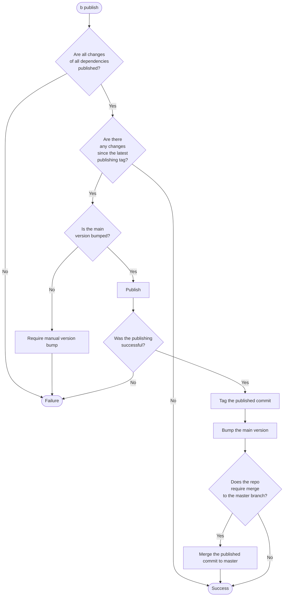
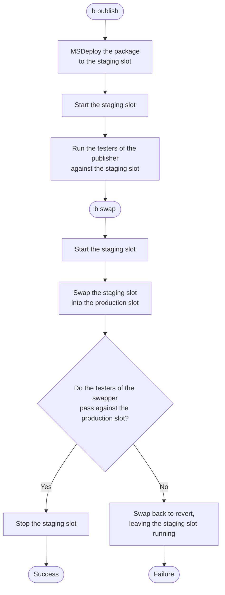

# Publishing flow

## Web sites

A web site is published by `MsDeployPublisher` to an Azure AppService deployment slot, then promoted to
production by `AppServiceSwapper`. The staging slot is stopped whenever no deployment is in progress: after a
swap it runs the application that was previously in production, which we do not want to keep running.

The swap runs either inline at the end of `b publish`, when `BuildConfigurationInfo.SwapAfterPublishing` is
set, or as a separate `b swap` step, which TeamCity exposes as its own build configuration. The staging slot
is started twice because these two steps can run hours apart.

Deploying to a stopped slot works because stopping a slot does not stop its SCM site, through which MSDeploy
works. Conversely, a slot must be running to be swapped: Azure restarts and warms up every instance of the
source slot and aborts the swap if any of them fails to answer an HTTP request. This is why the slot is
started before the swap and stopped only after it.

The staging slot is left running after a failed or reverted swap, so that the failed deployment can be
investigated and swapped back manually. It is stopped when the swap is skipped, which happens for a
pre-release when `Swapper.SwapPrerelease` is not set.

These properties opt out of the behavior:

| Property | Default | Effect when `false` |
|---|---|---|
| `MsDeployConfiguration.StartSlotAfterDeployment` | `true` | The slot is not started after the package has been deployed to it. |
| `AppServiceSwapper.StartSourceSlotBeforeSwap` | `true` | The source slot is not started before the swap. |
| `AppServiceSwapper.StopSourceSlotAfterSwap` | `true` | The source slot is left running after the swap. |