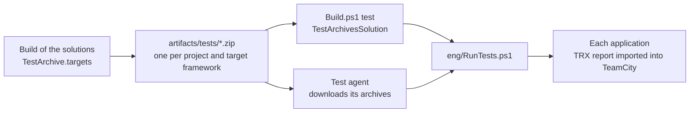

# Test Archives

A test archive is a zip file that holds one published test application and a manifest, `test.psd1`. The build
writes one archive per test project and target framework. A test agent downloads the archives it needs, and runs
them with the generated `eng/RunTests.ps1`.

The agent needs PowerShell 7.5 and the runtime that each application targets. It does not need the .NET SDK, the
build output of the product, or the source of the tests. An agent that tests one target framework downloads the
archives of that target framework only.

The test applications are [Microsoft.Testing.Platform](https://aka.ms/testingplatform) applications: executables that
run their own tests, such as a project that uses xunit.v3 or the runner of MSTest. An application that is not one of
them can still be archived, with a manifest of the `exe` kind (see below).

> [!NOTE]
> `eng/RunTests.ps1` is **generated**. The source of truth is
> `src/PostSharp.Engineering.BuildTools/Resources/RunTests.ps1`; regenerate the repository copy with
> `./Build.ps1 generate-scripts`. Never edit the generated file by hand.



## Writing the archives

A test project imports `TestArchive.targets` from the SDK, typically from `Directory.Build.targets`:

```xml
<Import Sdk="PostSharp.Engineering.Sdk" Project="TestArchive.targets" />
```

The target runs after the build of each target framework when the project is a test application
(`IsTestingPlatformApplication`, which xunit.v3 and the runner of MSTest set) and when `PublishTestArchive` is `true`.
`Build.ps1 build` sets that property for a product that has a `TestArchivesSolution` (see below), unless the command
line sets it. A build in the IDE does not set it, so it does not spend the time of a publication on every build.

The target publishes the application into `obj/<configuration>/<target framework>/test-archive`, writes `test.psd1`
there, and zips the directory to `artifacts/tests/<AssemblyName>.<TargetFramework>[.<RuntimeIdentifier>].zip`. The
repository root is the directory of the nearest `Build.ps1` above the project. The publication does not rebuild the
project: it publishes what the build has just written.

| Property or item | Default | Meaning |
|---|---|---|
| `PublishTestArchive` | | `true` to write the archive. |
| `TestArchiveDirectory` | `artifacts/tests` under the repository root | Where the archive goes. `Build.ps1 test` reads the default directory only. |
| `TestArchivePlatforms` | Every platform for .NET; `win-x64;win-arm64` for .NET Framework or a `-windows` target framework | The platforms that the application runs on, separated by semicolons. |
| `TestArchiveTimeoutSeconds` | `1800` | The time after which the runner kills the application. |
| `TestArchiveRunAlone` | `false` | `true` when the application must not run at the same time as another one, for example because its tests measure time. |
| `TestArchiveSkip` | | A reason not to run the application. The runner reports it and runs nothing. |
| `TestArchiveTag` item | | A tag that `RunTests.ps1 -Tags` and `-ExcludeTags` select the application by. |

To keep the archives small, the target sets `SatelliteResourceLanguages` to `en` unless the project sets it, and does
not publish the documentation files.

The SDK gives every .NET Framework executable a runtime identifier, `win-x86` by default. That identifier describes the
build and does not name the archive. A runtime identifier that the project sets does: a project that tests a .NET
Framework application as both x86 and x64 sets `RuntimeIdentifier` in each of the two builds, and gets two archives.

## The manifest

`test.psd1` is a PowerShell data file at the root of the archive. The platform identifiers are those of the
[Docker-based tests](docker-tests.md), with `osx-x64` and `osx-arm64` in addition.

```powershell
@{
    Name = 'MyProduct.Tests'
    TargetFramework = 'net10.0'
    RuntimeIdentifier = ''
    Kind = 'mtp'
    Entry = 'MyProduct.Tests.dll'
    Platforms = @('win-x64', 'win-arm64', 'linux-x64', 'linux-arm64', 'osx-x64', 'osx-arm64')
    Extensions = @('Microsoft.Testing.Extensions.TrxReport', 'Microsoft.Testing.Extensions.HangDump')
    Tags = @('TimeSensitive')
    TimeoutSeconds = 1800
    RunAlone = $true
    Skip = $null
}
```

| Field | Meaning |
|---|---|
| `Kind` | `mtp` for a Microsoft.Testing.Platform application, `exe` for any other executable. |
| `Entry` | The file to start, relative to the root of the archive. A `.dll` is started with `dotnet exec`, anything else directly. The target writes the `.dll` of a .NET application, because the application host of the build is for the operating system of the build, and the `.exe` of a .NET Framework application. |
| `Extensions` | The extensions registered in the application, from the `TestingPlatformBuilderHook` items of its build. The runner passes the options of an extension only when the application has it, because the platform refuses an option that no extension declares. |
| `Arguments` | `exe` only. The command line of the application. `{ResultsDirectory}` is replaced with the directory of its results. |
| `ReportType`, `ReportFile` | `exe` only. The TeamCity `importData` type of the report, such as `gtest`, and its path, in which `{ResultsDirectory}` is replaced. |

The other fields are those of the table above.

A product writes an archive of the `exe` kind itself, for example for a native test executable:

```powershell
@{
    Name = 'MyProduct.Native.Tests'
    Kind = 'exe'
    Entry = 'MyProduct.Native.Tests.exe'
    Platforms = @('win-x64')
    Arguments = @('--gtest_output=xml:{ResultsDirectory}/results.xml')
    ReportType = 'gtest'
    ReportFile = '{ResultsDirectory}/results.xml'
}
```

## Running the archives

```powershell
./eng/RunTests.ps1                                  # every archive that applies to this host
./eng/RunTests.ps1 -Platform linux-x64 -List        # what would run on linux-x64, and why the rest would not
./eng/RunTests.ps1 -Tags TimeSensitive              # the archives with this tag
./eng/RunTests.ps1 -Name 'MyProduct.Tests.net10.0' -ApplicationArguments '--filter-class', 'MyProduct.Tests.CacheTests'
```

`-ApplicationArguments` is an array, so call the script from PowerShell, or with `pwsh -Command`: `pwsh -File` passes
`a,b` as one string.

The runner reads the manifest of every archive without extracting the archive. An archive runs when its `Platforms`
contain the platform, when it has one of the `-Tags` (if any), none of the `-ExcludeTags`, and no `Skip`. The others
are listed with the reason. A run that selects no archive fails: a build configuration given the wrong archives, or a
tag with a typo, would otherwise report success without running a test.

Each selected archive is extracted to `artifacts/tests/run/<name>`, and its results go to
`artifacts/testResults/<name>` (the test results directory of the product). Before starting a .NET application, the
runner reads its `runtimeconfig.json` and fails with a message naming the missing runtime if the host does not have it.

The applications whose manifest sets `RunAlone` run first, one at a time. The others then run at most `-MaxParallel`
at a time, a quarter of the processors by default. The output of an application that runs alone is shown as it
arrives; the output of applications that run at the same time is shown in one block when each one finishes.

The runner passes these options to an application of the `mtp` kind:

| Option | When |
|---|---|
| `--results-directory` | Always. |
| `--report-trx --report-trx-filename <name>.trx` | The application has `Microsoft.Testing.Extensions.TrxReport`. |
| `--hangdump --hangdump-timeout` | The application has `Microsoft.Testing.Extensions.HangDump`. The dump is taken at 80% of the timeout, or five minutes before it, whichever is later, so that a hung application leaves a dump before the runner kills it. |
| `--crashdump` | The application has `Microsoft.Testing.Extensions.CrashDump` and is not a .NET Framework application, which that extension does not support. |
| `--ignore-exit-code 8` | `-ApplicationArguments` is given. Such arguments usually filter the tests, and an application in which the filter selects no test succeeds. Without them, an application that runs no test fails. |

### Reporting

When `TEAMCITY_VERSION` is set, the runner imports each report into TeamCity with `importData`, also when the
application failed, so that TeamCity shows which tests failed. A TRX report is imported as `mstest`.

Before the import, the runner gives each data row of a theory its own name. A TRX report names a row in the `name`
attribute of its `UnitTest` element, for example `Namespace.Class.Method(value: 1)`, but its `TestMethod` element
carries the name of the method only. The MSTest importer of TeamCity names a test from `TestMethod`, so without this
it reports every row of a theory as one test that ran several times.

A failed test, which is exit code 2, fails the build through the imported report. Any other failure is reported as a
`buildProblem`, because the report alone would leave the build green: an exit code other than 0 and 2, a timeout, a
missing report, a missing runtime, or a manifest that cannot be read. The exit codes of the platform are
listed at <https://aka.ms/testingplatform/exitcodes>.

A .NET Framework application run from a deep directory failed to load an assembly that was present, with a
`FileNotFoundException` that does not mention the path. The longest path was 257 characters, and the same files ran
from a path of 223. The limit of 260 characters of Windows is the likely cause. The runner warns when the longest
path of a .NET Framework application reaches 240 characters; use a shorter `-Path` if the application then fails.

## `Build.ps1 test`

A product runs its archives from `Build.ps1 test` by adding a `TestArchivesSolution` after the solutions whose test
projects write them:

```csharp
Solutions =
[
    new DotNetSolution( "src/MyProduct.sln" ) { TestMethod = BuildMethod.None },
    new TestArchivesSolution()
]
```

The solution builds nothing and runs `eng/RunTests.ps1`, with its `Tags` and `ExcludeTags`. Its presence also makes
`Build.ps1 build` pass `PublishTestArchive=true` to the other solutions. The clean step of the build deletes
`artifacts/tests`, so that the archive of a test project that was removed or renamed is not run again. `generate-scripts` writes
`eng/RunTests.ps1` for a product that has a `TestArchivesSolution`. The test filter of `Build.ps1 test` does not apply,
because the filter syntax of an application is that of its test framework; pass a filter with
`RunTests.ps1 -ApplicationArguments`.

The TeamCity configurations that run the archives on test agents are defined by the product for now.
