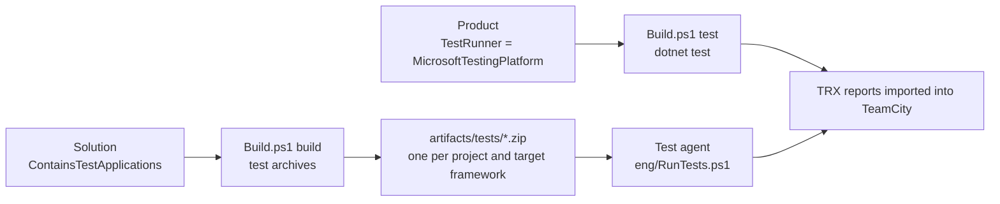

# Microsoft.Testing.Platform Tests

A [Microsoft.Testing.Platform](https://aka.ms/testingplatform) test application is an executable that runs its own
tests, such as a project that uses xunit.v3 or the runner of MSTest. PostSharp.Engineering runs these applications in
two places:

- **`Build.ps1 test`** runs them with `dotnet test`, in the mode of Microsoft.Testing.Platform.
- **Test agents** run test archives: zip files that the build writes, one per application and target framework, each
  with a manifest. An agent needs PowerShell 7.5 and the runtime of the application, and neither the .NET SDK nor the
  source of the product.



## `Build.ps1 test`

A product whose test projects are test applications sets `TestRunner`:

```csharp
var product = new Product( dependency ) { TestRunner = TestRunner.MicrosoftTestingPlatform, ... };
```

`dotnet test` runs test applications only in the mode of Microsoft.Testing.Platform, which is chosen by `global.json`
and nothing else. The `global.json` that PostSharp.Engineering generates therefore gets:

```json
"test": { "runner": "Microsoft.Testing.Platform" }
```

The mode applies to every `dotnet test` whose working directory is under the repository root. A directory that must
keep VSTest, such as a test that runs `dotnet test` on projects of its own, has a `global.json` of its own, without that
section: `dotnet` uses the `global.json` nearest to its working directory.

`Build.ps1 test` then passes the options of that mode to `dotnet test`:

| Option | Why |
|---|---|
| `--solution` or `--project` | The mode takes no positional argument; an argument it does not know goes to the test applications, which refuse it. |
| `--report-trx --results-directory <staging>` | The reports that PostSharp.Engineering imports into TeamCity. Every application must reference `Microsoft.Testing.Extensions.TrxReport`. |
| `--report-trx-filename report.trx --results-directory-layout per-module` | .NET SDK 11 and later. Each application writes into a directory of its own. The default layout names a report after the assembly, the target framework and the architecture, so `net10.0` and `net10.0-windows` would write the same file. |
| `--no-artifact-post-processing` | .NET SDK 11 and later. No merged report, which TeamCity would import beside the others and count every test twice. |
| `--filter <filter> --ignore-exit-code 8` | `--tests-filter` is given. xunit.v3 and MSTest both read the VSTest filter syntax. A filter can select no test in one application, which is then a success. |

The .NET SDK 10 accepts neither `--results-directory-layout` nor `--no-artifact-post-processing`: it passes them to the
applications, which exit with code 5. `Build.ps1 test` therefore asks `dotnet --version` for the SDK of the repository,
and with an SDK before 11 it passes only `--report-trx --results-directory <staging>`. Each application then writes
`<assembly>_<target framework>_<architecture>.trx` into the staging directory, and that SDK does not merge the reports.
Two target frameworks of one project that differ only by their operating system, such as `net10.0` and
`net10.0-windows`, write the same file with such an SDK, and the second report replaces the first without a warning.
`Build.ps1 test` therefore evaluates the test applications of the solution first, and fails with the name of the
project when it finds such a pair.

A `DotNetSolution` is built by `dotnet test`, as before. A `MsbuildSolution` is tested with `dotnet test --no-build`: it is
built by the MSBuild of Visual Studio, which a solution with native projects needs, and `dotnet test` only has to find
the applications that the build wrote. The `Test` target of a solution is not used, because it fails on every project
that does not define one. A test-only `MsbuildSolution`, which `Build.ps1 build` skips, is built first.

On TeamCity, each report is imported as described in [Reporting](#reporting).

## Describing a test application

A test project imports `TestArchive.targets` from the SDK, **after the body of the project**, typically from
`Directory.Build.targets`:

```xml
<Import Sdk="PostSharp.Engineering.Sdk" Project="TestArchive.targets" />
```

Its defaults are computed at evaluation time, from properties that the project and the .NET SDK set before that point,
such as the target framework. Imported earlier, the defaults would be computed from nothing.

These properties describe the application to its archive, to `RunTests.ps1` and to `generate-scripts`. `Build.ps1 test`
runs `dotnet test`, which does not read them.

| Property or item | Default | Meaning |
|---|---|---|
| `TestApplicationPlatforms` | Every platform for .NET; `win-x64;win-arm64` for .NET Framework or a `-windows` target framework | The platforms that the application runs on, separated by semicolons. The identifiers are those of the [Docker-based tests](docker-tests.md), with `osx-x64` and `osx-arm64` in addition. |
| `TestApplicationTimeoutSeconds` | `1800` | The time after which the application is stopped. |
| `TestApplicationRunAlone` | `false` | `true` when the application must not run at the same time as another one, for example because its tests measure time. |
| `TestApplicationSkip` | | A reason not to run the application. It is reported, and nothing runs. |
| `TestApplicationPrepareScript` | | A PowerShell script, relative to the project, that the runner runs before the application. See [Preparing an application](#preparing-an-application). |
| `TestApplicationArtifacts` | | The build artifacts that the prepare script reads, separated by semicolons, as paths relative to the repository in which the file name can contain wildcards. It is a property and not an item, because MSBuild expands the wildcards of an item at evaluation, before the artifacts exist. |
| `TestApplicationTag` item | | A tag that `RunTests.ps1 -Tags` and `-ExcludeTags` select the application by. |

The SDK gives every .NET Framework executable a runtime identifier, `win-x86` by default. That identifier describes the
build and not the application. A runtime identifier that the project sets does describe it: a project that tests a .NET
Framework application as both x86 and x64 sets `RuntimeIdentifier` in each of the two builds, and gets two archives.

## Test archives

A solution whose test applications run on agents sets `ContainsTestApplications`:

```csharp
new MsbuildSolution( @"Patterns\MyProduct.sln" ) { ContainsTestApplications = true }
```

`Build.ps1 build` then passes `PublishTestArchive=true` to the build of the solutions, unless the command line sets
it. A build in the IDE does not set it, so it does not spend the time of a publication on every build. On TeamCity,
`Build.ps1 build` writes the archives only in the build configuration that the test agents download them from: see
[The build configurations](#the-build-configurations). The clean step
deletes `artifacts/tests`, so that the archive of a test project that was removed or renamed is not run again, and
`generate-scripts` writes `eng/RunTests.ps1`.

The archive is written by the build of the test project. `Build.ps1 build` packs a `DotNetSolution` with `dotnet pack`,
which does not build the projects that are not packable, and a test project is not packable. A `DotNetSolution` that
contains test applications therefore sets `PackRequiresExplicitBuild`, so that the whole solution is built before it is
packed:

```csharp
new DotNetSolution( "MyProduct.sln" ) { ContainsTestApplications = true, PackRequiresExplicitBuild = true }
```

> [!NOTE]
> `eng/RunTests.ps1` is **generated**. The source of truth is
> `src/PostSharp.Engineering.BuildTools/Resources/RunTests.ps1`; regenerate the repository copy with
> `./Build.ps1 generate-scripts`. Never edit the generated file by hand.

After the build of each target framework of a test application, `TestArchive.targets` publishes the application into
`obj/<configuration>/<target framework>/test-archive`, writes `test.psd1` there, and zips the directory to
`artifacts/tests/<AssemblyName>.<TargetFramework>[.<RuntimeIdentifier>].zip`. The repository root is the directory of
the nearest `Build.ps1` above the project; `TestArchiveDirectory` changes it. The publication does not rebuild the
project: it publishes what the build has just written. To keep the archives small, the target sets
`SatelliteResourceLanguages` to `en` unless the project sets it, and does not publish the documentation files.

### The manifest

`test.psd1` is a PowerShell data file at the root of the archive.

```powershell
@{
    Name = 'MyProduct.Tests'
    TargetFramework = 'net10.0'
    RuntimeIdentifier = ''
    Kind = 'mtp'
    Entry = 'MyProduct.Tests.dll'
    Platforms = @('win-x64', 'win-arm64', 'linux-x64', 'linux-arm64', 'osx-x64', 'osx-arm64')
    Extensions = @('Microsoft.Testing.Extensions.TrxReport', 'Microsoft.Testing.Extensions.HangDump')
    Tags = @('TimeSensitive')
    TimeoutSeconds = 1800
    RunAlone = $true
    Skip = $null
    Prepare = $null
    Artifacts = @()
}
```

| Field | Meaning |
|---|---|
| `Kind` | `mtp` for a Microsoft.Testing.Platform application, `exe` for any other executable, `ps1` for a PowerShell script that runs the tests itself. |
| `Entry` | The file to start, relative to the root of the archive. A `.dll` is started with `dotnet exec`, anything else directly. The target writes the `.dll` of a .NET application, because the application host of the build is for the operating system of the build, and the `.exe` of a .NET Framework application. |
| `Extensions` | The extensions registered in the application, from the `TestingPlatformBuilderHook` items of its build. |
| `Arguments` | `exe` only. The command line of the application. `{ResultsDirectory}` is replaced with the directory of its results. |
| `ReportType`, `ReportFile` | `exe` and `ps1` only. The TeamCity `importData` type of the reports, such as `gtest`, and their path, in which `{ResultsDirectory}` is replaced and the file name can contain wildcards. |
| `Prepare` | The file name of the prepare script at the root of the archive, from `TestApplicationPrepareScript`, or `$null`. |
| `Artifacts` | The build artifacts that the prepare script reads, from `TestApplicationArtifacts`. |

The other fields are the properties of [Describing a test application](#describing-a-test-application).

A product writes an archive of the `exe` kind itself, for example for a native test executable:

```powershell
@{
    Name = 'MyProduct.Native.Tests'
    Kind = 'exe'
    Entry = 'MyProduct.Native.Tests.exe'
    Platforms = @('win-x64')
    Arguments = @('--gtest_output=xml:{ResultsDirectory}/results.xml')
    ReportType = 'gtest'
    ReportFile = '{ResultsDirectory}/results.xml'
}
```

### Archives of the `ps1` kind

A test that is not a .NET application, such as a native test executable that needs files put beside it before it runs,
is described by a project of its solution that sets `TestApplicationKind` to `ps1`. The archive is still a zip in
`artifacts/tests` with its `test.psd1`, but instead of a publication of the project it holds a PowerShell script, its
entry, and the files that the project lists:

```xml
<PropertyGroup>
  <TestApplicationKind>ps1</TestApplicationKind>
  <TestApplicationEntry>RunTest.ps1</TestApplicationEntry>
  <TestApplicationReportType>gtest</TestApplicationReportType>
  <TestApplicationReportFile>{ResultsDirectory}/*.xml</TestApplicationReportFile>
</PropertyGroup>
<ItemGroup>
  <TestApplicationFile Include="bin/x64/Release/MyProduct.Native.Tests.exe" ArchivePath="x64/MyProduct.Native.Tests.exe" />
</ItemGroup>
```

`RunTests.ps1` runs the script with the PowerShell that runs it, as `RunTest.ps1 -Platform <platform> -ResultsDirectory
<directory>`, like a [Docker test](docker-tests.md). The script runs the tests and writes its reports into the results
directory, and the runner imports the reports that `ReportFile` names. A zero exit code is success. The other properties
of the application, such as the platforms, the tags, a prepare script and the artifacts it reads, apply as they do to a
test application, and `generate-scripts` plans the archive as it plans any other.

### Running the archives

```powershell
./eng/RunTests.ps1                                  # every archive that applies to this host
./eng/RunTests.ps1 -Platform linux-x64 -List        # what would run on linux-x64, and why the rest would not
./eng/RunTests.ps1 -Tags TimeSensitive              # the archives with this tag
./eng/RunTests.ps1 -Name 'MyProduct.Tests.net10.0' -ApplicationArguments '--filter-class', 'MyProduct.Tests.CacheTests'
```

`-ApplicationArguments` is an array, so call the script from PowerShell, or with `pwsh -Command`: `pwsh -File` passes
`a,b` as one string.

The runner reads the manifest of every archive without extracting the archive. An archive runs when its `Platforms`
contain the platform, when it has one of the `-Tags` (if any), none of the `-ExcludeTags`, and no `Skip`. The others
are listed with the reason. A run that selects no archive fails: a build configuration given the wrong archives, or a
tag with a typo, would otherwise report success without running a test.

Each selected archive is extracted to `artifacts/tests/run/<name>`, and its results go to
`artifacts/testResults/<name>` (the test results directory of the product). Before starting a .NET application, the
runner reads its `runtimeconfig.json` and fails with a message naming the missing runtime if the host does not have it.

The applications whose manifest sets `RunAlone` run first, one at a time. The others then run at most `-MaxParallel`
at a time, a quarter of the processors by default.

The output of each application goes to `stdout.log` and `stderr.log` in its results directory. Without TeamCity, the
runner also shows it: the output of an application that runs alone as it arrives, and the output of applications that
run at the same time in one block when each one finishes. On TeamCity, the runner does not write the output to the
build log, because a large build log slows TeamCity down. It writes only the last 100 lines of each file when an
application fails. `-ShowOutput` writes the whole output on TeamCity too. The results of the tests, with the output of
each test, are in the report.

`-ApplicationArguments` is added to the command line of every application. When it is given, an application in which
no test ran succeeds, because such arguments usually filter the tests.

A .NET Framework application run from a deep directory failed to load an assembly that was present, with a
`FileNotFoundException` that does not mention the path. The longest path was 257 characters, and the same files ran
from a path of 223. The limit of 260 characters of Windows is the likely cause. The runner warns when the longest
path of a .NET Framework application reaches 240 characters; use a shorter `-Path` if the application then fails.

### Preparing an application

A test application that needs more than its own files, for example a tool that a package of the product ships,
declares a prepare script and the build artifacts that the script reads:

```xml
<PropertyGroup>
  <TestApplicationPrepareScript>TestPrepare.ps1</TestApplicationPrepareScript>
  <TestApplicationArtifacts>artifacts/publish/public/MyProduct.*.nupkg</TestApplicationArtifacts>
</PropertyGroup>
```

The script is packed at the root of the archive. The runner checks that every declared artifact is present under the
repository, then runs the script after extracting the archive and before starting the application:

- The script runs in the process of the runner, in the directory of the application.
- It receives `-RepositoryRoot`, under which the artifacts were downloaded, and `-ApplicationDirectory`.
- It returns a hashtable of environment variables, which the runner gives to the application. It writes any other
  output to the console.
- An exception or a non-zero exit code fails the archive, and the application does not start.

The script runs for its own archive only, once per run. It must not need the .NET SDK, which the test agents do not
have: a `.nupkg` is a zip file, which `Expand-Archive` extracts. An environment variable lets the tests override a
location they otherwise take from the source tree, so that the same tests run from the IDE, from `dotnet test` and
from an archive.

## Test agents

A product declares the kinds of agents that run its archives, and `generate-scripts` creates their build
configurations:

```csharp
var product = new Product( dependency )
{
    TestArchivesSourceDependency = new SnapshotDependency( BuildConfiguration.Release ),   // the tested build; the default is Public
    TestAgents =
    [
        new TestAgent( "win-x64", "UnitTestWinX64", "Unit Tests Windows x64", windowsContainerRequirements )
        {
            Dockerfile = "eng/docker/build.Dockerfile", SeparateTags = ["TimeSensitive"]
        },
        new TestAgent( "osx-arm64", "UnitTestMacOsArm64", "Unit Tests macOS ARM64", macOsRequirements )
    ],
    ...
};
```

### Discovering the test applications

`generate-scripts` evaluates the managed projects of the solutions that set `ContainsTestApplications`, and of those
only: a repository can hold hundreds of other projects.

```csharp
new MsbuildSolution( @"Patterns\MyProduct.sln" ) { ContainsTestApplications = true }
```

It evaluates each target framework, in the build configuration of `TestArchivesSourceDependency`, and builds and restores nothing.
`Build.ps1 list-test-applications` shows what it finds.

A project is a test application when it says so in a property that it sets itself. `IsTestingPlatformApplication` is
set by the packages of the test frameworks, which are imported only after a restore, so `UseMicrosoftTestingPlatformRunner`
(xunit.v3) and `EnableMSTestRunner` (MSTest) are read too. An explicit `IsTestingPlatformApplication=false` wins: that is
how a project that references a test project, and therefore receives the props of its test framework, says that it is
not one.

Two applications with one archive name are an error, because one of them would never be tested. A project built for two
processor architectures under one assembly name sets `RuntimeIdentifier` in each build.

### The build configurations

Each agent gets one build configuration per runtime of the applications that apply to its platform: the target
framework without its operating system, so that `net10.0` and `net10.0-windows` run together. The applications of each
tag of `SeparateTags` run in a build configuration of their own, and the others run with `-ExcludeTags`. A skipped
application is not downloaded. A composite configuration, `RunAllTestArchives`, runs them all.

A build configuration downloads exactly the archives it runs, one artifact rule per archive, from `TestArchivesSourceDependency`,
and the artifacts that their prepare scripts read, each to its own path. It downloads nothing else of the build: no other
package, and none of the artifacts of the products this product depends on. It runs
`eng/RunTests.ps1 -Platform <platform>`, in a container when the requirements of the agent are those of a container
host, and publishes the test results directory.

Only the build that `TestArchivesSourceDependency` names writes and publishes the archives. When it names a product build
configuration, the public build by default, `Build.ps1 build` of that configuration writes them, and PostSharp.Engineering
gives its build configuration, or the `CustomBuildConfiguration` that replaces it, the rule `artifacts/tests/*.zip`. When
it names an additional build configuration, the product gives that configuration `-p:PublishTestArchive=true` and the
rule, and `generate-scripts` fails when either is missing. The other builds of the product do not spend the time of writing the archives, nor the space of publishing them.

A product that tests one build and ships another, signed one names the tested build here. To ship what it tested, it
gives the tested configuration the version of the public build (`BuildConfigurationInfo.VersionKind`, see the README),
and compares the two builds.

### Staying current

An application added without running `generate-scripts` again would be in no build configuration, and would silently
not be tested. `generate-scripts` therefore writes the list of the archives it planned to `eng/test-archives.txt`, and
`Build.ps1 build` fails when the archives it writes differ from that list: an archive missing from the list is run by no
build configuration, and a listed archive that the build did not write fails the download of the configurations that
run it.

## Options of the archives

`RunTests.ps1` passes these options to an application of the `mtp` kind, each only when the application has the
extension that declares it, because the platform refuses an option that no extension declares:

| Option | When |
|---|---|
| `--results-directory` | Always. |
| `--report-trx --report-trx-filename <name>.trx` | The application has `Microsoft.Testing.Extensions.TrxReport`. |
| `--hangdump --hangdump-timeout` | The application has `Microsoft.Testing.Extensions.HangDump`. The dump is taken at 80% of the timeout, or five minutes before it, whichever is later, so that a hung application leaves a dump before it is stopped. |
| `--crashdump` | The application has `Microsoft.Testing.Extensions.CrashDump` and is not a .NET Framework application, which that extension does not support. |
| `--ignore-exit-code 8` | `-ApplicationArguments` is given. Such arguments usually filter the tests, and an application in which the filter selects no test succeeds. |

## Reporting

The runner detects TeamCity from the `TEAMCITY_VERSION` or the `IS_TEAMCITY_AGENT` environment variable:
`DockerBuild.ps1` passes only the latter to the container. `-NoTeamCity` disables the service messages.

On TeamCity, each TRX report is imported with `importData` of the `mstest` type, also when the application failed, so
that TeamCity shows which tests failed.

Before the import, each data row of a theory is given its own name. A TRX report names a row in the `name` attribute of
its `UnitTest` element, for example `Namespace.Class.Method(value: 1)`, but its `TestMethod` element carries the name of
the method only. The MSTest importer of TeamCity names a test from `TestMethod`, so without this it reports every row of
a theory as one test that ran several times.

In `RunTests.ps1`, a failed test, which is exit code 2, fails the build through the imported report. Any other failure
is reported as a `buildProblem`, because the report alone would leave the build green: an exit code other than 0 and 2,
a timeout, a missing report, a missing runtime, or a manifest that cannot be read. `Build.ps1 test` fails when
`dotnet test` fails. The exit codes of the platform are listed at <https://aka.ms/testingplatform/exitcodes>.
