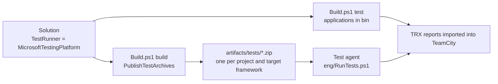

# Microsoft.Testing.Platform Tests

A [Microsoft.Testing.Platform](https://aka.ms/testingplatform) test application is an executable that runs its own
tests, such as a project that uses xunit.v3 or the runner of MSTest. PostSharp.Engineering runs these applications in
two places:

- **`Build.ps1 test`** runs the applications of the solutions that declare them, from their build output.
- **Test agents** run test archives: zip files that the build writes, one per application and target framework, each
  with a manifest. An agent needs PowerShell 7.5 and the runtime of the application, and neither the .NET SDK nor the
  source of the product.



## `Build.ps1 test`

A solution whose test projects are test applications sets `TestRunner`. The property exists on `DotNetSolution` and on
`MsbuildSolution`:

```csharp
new MsbuildSolution( @"Patterns\MyProduct.sln" ) { TestRunner = TestRunner.MicrosoftTestingPlatform }
```

`Build.ps1 test` then does not run `dotnet test`, whose mode is chosen for the whole repository by `global.json`, nor the
`Test` target of the solution, which fails on every project that does not define one. It writes a project that calls a
target on every managed project of the solution, and a targets file that defines that target, which it gives to the
projects as `CustomAfterMicrosoftCommonTargets` and `CustomAfterMicrosoftCommonCrossTargetingTargets`. In each build of
a test application, the target runs the application that the build has written, with the `InvokeTestingPlatform`
target of `Microsoft.Testing.Platform.MSBuild`. Nothing is built: `Build.ps1 test` builds the product first, unless
`--no-dependencies` is given.

The applications that set `TestApplicationRunAlone` run first, one at a time; the others then run in parallel. The
options passed to each application are those of the table in [Options](#options). The filter of `Build.ps1 test
--tests-filter` is passed as `--filter`, which xunit.v3 and MSTest both read.

Both files are kept in `artifacts/testing-platform/<solution>`, so that a failed run can be diagnosed from them. The
reports are imported into TeamCity once all the applications have exited, as described in [Reporting](#reporting).

A product that sets `CustomAfterMicrosoftCommonTargets` itself loses its own value during the test run, because the
global property replaces it.

## Describing a test application

A test project imports `TestArchive.targets` from the SDK, **after the body of the project**, typically from
`Directory.Build.targets`:

```xml
<Import Sdk="PostSharp.Engineering.Sdk" Project="TestArchive.targets" />
```

Its defaults are computed at evaluation time, from properties that the project and the .NET SDK set before that point,
such as the target framework. Imported earlier, the defaults would be computed from nothing.

| Property or item | Default | Meaning |
|---|---|---|
| `TestApplicationPlatforms` | Every platform for .NET; `win-x64;win-arm64` for .NET Framework or a `-windows` target framework | The platforms that the application runs on, separated by semicolons. The identifiers are those of the [Docker-based tests](docker-tests.md), with `osx-x64` and `osx-arm64` in addition. |
| `TestApplicationTimeoutSeconds` | `1800` | The time after which the application is stopped. |
| `TestApplicationRunAlone` | `false` | `true` when the application must not run at the same time as another one, for example because its tests measure time. |
| `TestApplicationSkip` | | A reason not to run the application. It is reported, and nothing runs. |
| `TestApplicationTag` item | | A tag that `RunTests.ps1 -Tags` and `-ExcludeTags` select the application by. |

The SDK gives every .NET Framework executable a runtime identifier, `win-x86` by default. That identifier describes the
build and not the application. A runtime identifier that the project sets does describe it: a project that tests a .NET
Framework application as both x86 and x64 sets `RuntimeIdentifier` in each of the two builds, and gets two archives.

## Test archives

A product that runs its tests on agents sets `PublishTestArchives`:

```csharp
var product = new Product( dependency ) { PublishTestArchives = true, ... };
```

`Build.ps1 build` then passes `PublishTestArchive=true` to the build of the solutions, unless the command line sets
it. A build in the IDE does not set it, so it does not spend the time of a publication on every build. The clean step
deletes `artifacts/tests`, so that the archive of a test project that was removed or renamed is not run again, and
`generate-scripts` writes `eng/RunTests.ps1`.

> [!NOTE]
> `eng/RunTests.ps1` is **generated**. The source of truth is
> `src/PostSharp.Engineering.BuildTools/Resources/RunTests.ps1`; regenerate the repository copy with
> `./Build.ps1 generate-scripts`. Never edit the generated file by hand.

After the build of each target framework of a test application, `TestArchive.targets` publishes the application into
`obj/<configuration>/<target framework>/test-archive`, writes `test.psd1` there, and zips the directory to
`artifacts/tests/<AssemblyName>.<TargetFramework>[.<RuntimeIdentifier>].zip`. The repository root is the directory of
the nearest `Build.ps1` above the project; `TestArchiveDirectory` changes it. The publication does not rebuild the
project: it publishes what the build has just written. To keep the archives small, the target sets
`SatelliteResourceLanguages` to `en` unless the project sets it, and does not publish the documentation files.

### The manifest

`test.psd1` is a PowerShell data file at the root of the archive.

```powershell
@{
    Name = 'MyProduct.Tests'
    TargetFramework = 'net10.0'
    RuntimeIdentifier = ''
    Kind = 'mtp'
    Entry = 'MyProduct.Tests.dll'
    Platforms = @('win-x64', 'win-arm64', 'linux-x64', 'linux-arm64', 'osx-x64', 'osx-arm64')
    Extensions = @('Microsoft.Testing.Extensions.TrxReport', 'Microsoft.Testing.Extensions.HangDump')
    Tags = @('TimeSensitive')
    TimeoutSeconds = 1800
    RunAlone = $true
    Skip = $null
}
```

| Field | Meaning |
|---|---|
| `Kind` | `mtp` for a Microsoft.Testing.Platform application, `exe` for any other executable. |
| `Entry` | The file to start, relative to the root of the archive. A `.dll` is started with `dotnet exec`, anything else directly. The target writes the `.dll` of a .NET application, because the application host of the build is for the operating system of the build, and the `.exe` of a .NET Framework application. |
| `Extensions` | The extensions registered in the application, from the `TestingPlatformBuilderHook` items of its build. |
| `Arguments` | `exe` only. The command line of the application. `{ResultsDirectory}` is replaced with the directory of its results. |
| `ReportType`, `ReportFile` | `exe` only. The TeamCity `importData` type of the report, such as `gtest`, and its path, in which `{ResultsDirectory}` is replaced. |

The other fields are the properties of [Describing a test application](#describing-a-test-application).

A product writes an archive of the `exe` kind itself, for example for a native test executable:

```powershell
@{
    Name = 'MyProduct.Native.Tests'
    Kind = 'exe'
    Entry = 'MyProduct.Native.Tests.exe'
    Platforms = @('win-x64')
    Arguments = @('--gtest_output=xml:{ResultsDirectory}/results.xml')
    ReportType = 'gtest'
    ReportFile = '{ResultsDirectory}/results.xml'
}
```

### Running the archives

```powershell
./eng/RunTests.ps1                                  # every archive that applies to this host
./eng/RunTests.ps1 -Platform linux-x64 -List        # what would run on linux-x64, and why the rest would not
./eng/RunTests.ps1 -Tags TimeSensitive              # the archives with this tag
./eng/RunTests.ps1 -Name 'MyProduct.Tests.net10.0' -ApplicationArguments '--filter-class', 'MyProduct.Tests.CacheTests'
```

`-ApplicationArguments` is an array, so call the script from PowerShell, or with `pwsh -Command`: `pwsh -File` passes
`a,b` as one string.

The runner reads the manifest of every archive without extracting the archive. An archive runs when its `Platforms`
contain the platform, when it has one of the `-Tags` (if any), none of the `-ExcludeTags`, and no `Skip`. The others
are listed with the reason. A run that selects no archive fails: a build configuration given the wrong archives, or a
tag with a typo, would otherwise report success without running a test.

Each selected archive is extracted to `artifacts/tests/run/<name>`, and its results go to
`artifacts/testResults/<name>` (the test results directory of the product). Before starting a .NET application, the
runner reads its `runtimeconfig.json` and fails with a message naming the missing runtime if the host does not have it.

The applications whose manifest sets `RunAlone` run first, one at a time. The others then run at most `-MaxParallel`
at a time, a quarter of the processors by default. The output of an application that runs alone is shown as it
arrives; the output of applications that run at the same time is shown in one block when each one finishes.

`-ApplicationArguments` is added to the command line of every application. When it is given, an application in which
no test ran succeeds, because such arguments usually filter the tests.

A .NET Framework application run from a deep directory failed to load an assembly that was present, with a
`FileNotFoundException` that does not mention the path. The longest path was 257 characters, and the same files ran
from a path of 223. The limit of 260 characters of Windows is the likely cause. The runner warns when the longest
path of a .NET Framework application reaches 240 characters; use a shorter `-Path` if the application then fails.

## Test agents

A product declares the kinds of agents that run its archives, and `generate-scripts` creates their build
configurations:

```csharp
var product = new Product( dependency )
{
    PublishTestArchives = true,
    TestArchivesSource = new SnapshotDependency( "BuildArtifacts" ),   // defaults to the public build
    TestAgents =
    [
        new TestAgent( "win-x64", "UnitTestWinX64", "Unit Tests Windows x64", windowsContainerRequirements )
        {
            Dockerfile = "eng/docker/build.Dockerfile", SeparateTags = ["TimeSensitive"]
        },
        new TestAgent( "osx-arm64", "UnitTestMacOsArm64", "Unit Tests macOS ARM64", macOsRequirements )
    ],
    ...
};
```

### Discovering the test applications

`generate-scripts` evaluates the managed projects of the solutions whose `TestRunner` is
`MicrosoftTestingPlatform`, and of those only: a repository can hold hundreds of other projects. It evaluates each
target framework, and builds and restores nothing. `Build.ps1 list-test-applications` shows what it finds.

A project is a test application when it says so in a property that it sets itself. `IsTestingPlatformApplication` is
set by the packages of the test frameworks, which are imported only after a restore, so `UseMicrosoftTestingPlatformRunner`
(xunit.v3) and `EnableMSTestRunner` (MSTest) are read too. An explicit `IsTestingPlatformApplication=false` wins: that is
how a project that references a test project, and therefore receives the props of its test framework, says that it is
not one.

Two applications with one archive name are an error, because one of them would never be tested. A project built for two
processor architectures under one assembly name sets `RuntimeIdentifier` in each build.

### The build configurations

Each agent gets one build configuration per runtime of the applications that apply to its platform: the target
framework without its operating system, so that `net10.0` and `net10.0-windows` run together. The applications of each
tag of `SeparateTags` run in a build configuration of their own, and the others run with `-ExcludeTags`. A skipped
application is not downloaded. A composite configuration, `RunAllTestArchives`, runs them all.

A build configuration downloads exactly the archives it runs, one artifact rule per archive, from `TestArchivesSource`,
and nothing else of the build: no package, and none of the artifacts of the products this product depends on. It runs
`eng/RunTests.ps1 -Platform <platform>`, in a container when the requirements of the agent are those of a container
host, and publishes the test results directory. The build that publishes the archives publishes
`artifacts/tests/*.zip`; PostSharp.Engineering adds that rule to the product build configurations, and a product that
names another build configuration adds it there.

### Staying current

An application added without running `generate-scripts` again would be in no build configuration, and would silently
not be tested. `generate-scripts` therefore writes the list of the archives it planned to `eng/test-archives.txt`, and
`Build.ps1 build` fails when the archives it writes differ from that list: an archive missing from the list is run by no
build configuration, and a listed archive that the build did not write fails the download of the configurations that
run it.

## Options

`Build.ps1 test` and `RunTests.ps1` pass the same options to an application of the `mtp` kind, because the platform
refuses an option that no extension of the application declares:

| Option | When |
|---|---|
| `--results-directory` | Always. |
| `--report-trx --report-trx-filename <name>.trx` | The application has `Microsoft.Testing.Extensions.TrxReport`. |
| `--hangdump --hangdump-timeout` | The application has `Microsoft.Testing.Extensions.HangDump`. The dump is taken at 80% of the timeout, or five minutes before it, whichever is later, so that a hung application leaves a dump before it is stopped. |
| `--crashdump` | The application has `Microsoft.Testing.Extensions.CrashDump` and is not a .NET Framework application, which that extension does not support. |
| `--filter <filter> --ignore-exit-code 8` | `Build.ps1 test --tests-filter` is given. A filter can select no test in an application, which is then a success. |

## Reporting

On TeamCity, each TRX report is imported with `importData` of the `mstest` type, also when the application failed, so
that TeamCity shows which tests failed.

Before the import, each data row of a theory is given its own name. A TRX report names a row in the `name` attribute of
its `UnitTest` element, for example `Namespace.Class.Method(value: 1)`, but its `TestMethod` element carries the name of
the method only. The MSTest importer of TeamCity names a test from `TestMethod`, so without this it reports every row of
a theory as one test that ran several times.

In `RunTests.ps1`, a failed test, which is exit code 2, fails the build through the imported report. Any other failure
is reported as a `buildProblem`, because the report alone would leave the build green: an exit code other than 0 and 2,
a timeout, a missing report, a missing runtime, or a manifest that cannot be read. `Build.ps1 test` fails on any failure
of an application. The exit codes of the platform are listed at <https://aka.ms/testingplatform/exitcodes>.
